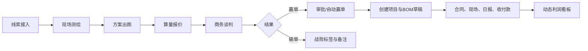

# 工装项目全流程管理系统（精简版）PRD

| 项目 | 内容 |
| --- | --- |
| 版本 | V1.0 |
| 状态 | 待评审 |
| 产品目标 | 让跟单、项目、BOM、现场、合同及资金数据形成可追溯闭环。 |
| 一期范围 | 线索、项目与 BOM、整改工单、人力日报、合同台账、收付款与利润看板。 |

## 1. 背景与目标

目前销售过程、现场问题、合同回款与项目成本分散在个人沟通和表格中，管理者难以及时判断成交原因、项目风险与利润。

系统一期应达成：

1. 跟单阶段可见、可催办，输单原因可统计。
2. 赢单后自动创建项目并生成 BOM 草稿，减少重复录入。
3. 现场整改必须拍照闭环；未闭环整改阻止关键验收。
4. 合同、付款、质保金有可执行的提醒；项目收入、成本、现金流可查询。

### 1.1 非目标

- 一期不实现完整采购供应链、库存、发票和总账。
- 一期不承诺解析 `.mpp`；仅支持 Project XML 与手工/Excel 计划导入。
- 一期不自建具备法律效力的电子签章；保留第三方电子签对接位。
- 一期移动端采用响应式 H5 和弱网草稿，不实现多端实时冲突合并。

## 2. 用户、角色与权限

| 角色 | 可操作范围 |
| --- | --- |
| 业务 | 创建和编辑本人线索、推进线索、记录谈判与输单、提交赢单审批、查看本人项目摘要。 |
| 设计 | 上传方案、维护物料字典和标准配方、编辑 BOM 草稿、参与报价。 |
| 项目经理 | 查看负责项目、维护项目资料与 BOM、创建派发验收工单、审核人力日报、维护进度。 |
| 财务 | 查看合同和项目利润、维护收款/付款记录、处理 AR 待办与质保金催收。 |
| 老板 | 查看全部数据和报表；审批超阈值赢单/合同；强制解锁验收并填写原因。 |

数据权限默认遵循“本人线索、负责项目、财务金额数据、老板全量”。老板可配置项目负责人和业务归属。

## 3. 全局规则

### 3.1 编号与审计

- 项目编号：`XM-YYMM-NNNN`，按自然月从 `0001` 递增，例如 `XM-2607-0001`；同月不可重复。
- 合同编号：`HT-YYMM-NNNN`；BOM 编号：`BOM-项目编号-版本号`；工单编号：`WO-YYMM-NNNN`。
- 所有状态流转、审批、金额、数量、单价、日期及强制解锁变更，均写入不可修改的操作日志：对象、操作前后值、操作人、时间、备注。

### 3.2 附件与日历

- 支持图片、PDF、Word、Excel、`.xml`、`.mpp` 上传；单文件最大 50MB。MVP 中 `.mpp` 仅归档，不自动解析。
- 每条附件记录上传人、上传时间、文件名、类型、大小与关联业务对象。
- 默认工作日为周一至周日；管理员可维护法定节假日。项目预警按自然日计算，后续可切换为工作日计算。

### 3.3 提醒与待办

- 系统每日 09:00 扫描常规逾期提醒；工单超时每小时扫描一次。
- 同一对象、同一提醒类型每日最多推送一次；状态恢复或关闭后停止提醒。
- 站内待办为一期必选；短信、邮件、钉钉/企微为可配置扩展。

## 4. 核心流程

## 5. 功能需求

### 5.1 模块零：线索跟进与转化

#### 5.1.1 状态机

线索必须按以下顺序流转，不支持跳级或回退；如需回退，由老板在操作日志中说明原因：

`线索接入 → 现场测绘 → 方案出图 → 算量报价 → 商务谈判 → 赢单 / 输单`

| 当前阶段 | 操作人 | 进入下一阶段的校验 | 阶段超时默认值 |
| --- | --- | --- | --- |
| 线索接入 | 业务 | 客户、面积、预算、来源必填 | 7 天 |
| 现场测绘 | 业务、项目经理 | 至少上传一份测绘报告 | 5 天 |
| 方案出图 | 设计 | 至少上传一份方案文件 | 10 天 |
| 算量报价 | 业务、设计 | 已生成报价记录和报价金额 | 5 天 |
| 商务谈判 | 业务 | 至少一条谈判记录 | 15 天 |

超时后向当前负责人和老板创建待办；负责人处理或阶段流转后自动关闭。

#### 5.1.2 线索字段与赢输单

- 线索字段：线索名称、客户名称、联系人、电话、项目地址、预计面积、预计预算、来源、业务负责人、当前阶段、预计成交日期、备注。
- 报价记录独立保存：版本、报价金额、成本估算、税率、有效期、附件、创建人、创建时间。
- 赢单规则：报价/预计合同金额大于 50,000 元时，业务提交老板审批；不大于 50,000 元时可直接赢单。审批通过或直接赢单后，系统在 1 分钟内创建项目和 BOM 草稿。
- 输单时必须选择至少一个标签：价格超预算、败给竞品、工期无法满足、设计方案未中标、项目搁置、付款条件未达成、其他。选择“其他”时备注必填。

**验收标准**：没有测绘报告不能进入方案出图；没有报价不能进入商务谈判；没有战败标签不能输单；赢单后可在项目列表看到关联项目和 BOM 草稿。

### 5.2 模块一：造价与 BOM

#### 5.2.1 项目类型与报价

- 小型修缮：预计面积 `≤50㎡` **且** 预计金额 `≤10,000 元`；输入面积并选择标准配方后生成底价。
- 大型项目：不满足小型修缮条件的项目；以项目 BOM 台账进行成本测算。
- 标准配方需包含适用面积范围、物料清单、物料单位用量、人工系数、管理费系数。底价 = 物料成本 + 人工成本 + 管理费。

#### 5.2.2 物料字典与 BOM

物料字典字段：物料编码（唯一）、名称、规格、品类、单位、默认损耗率、基准价、最近采购价、启用状态。

BOM 主档字段：BOM 编号、关联项目、版本号、状态（草稿/已确认/已变更）、创建人、确认人、确认时间。

BOM 明细字段：物料编码、物料名称、设计用量、损耗率、采购数量、单价、小计、备注。其中：

- 采购数量 = 设计用量 × (1 + 损耗率)，按物料单位的精度向上取整。
- 小计 = 采购数量 × 单价。
- BOM 总额 = 明细小计汇总。

确认 BOM 后不可直接修改。发生变更时基于已确认版本复制生成新版本（如 `V1.0 → V1.1`），旧版本只读保留。项目经理和设计均可提交确认，项目经理最终确认。

**验收标准**：物料编码不可重复；确认 BOM 后明细不可编辑；新版本不改变旧版本金额和明细；赢单项目可自动生成 `V0.1` 草稿 BOM。

### 5.3 模块三：现场防漏与品控

#### 5.3.1 电子工单

工单字段：工单编号、项目、类型（整改/一般）、问题描述、现场照片、责任人、状态、计划完成时间、验收结论、销账照片、创建与更新时间。

状态机：`待派发 → 处理中 → 待验收 → 已销账`；验收不通过时回到“处理中”。

- 项目经理创建工单并指定责任人；如无工长账号，可指定本人。
- “已销账”前必须至少上传一张销账照片。
- 整改类工单只要存在非“已销账”记录，项目的“隐蔽工程验收”和“竣工验收”不可提交。
- 老板可强制解除锁定，必须填写原因；系统记录操作日志，并在项目风险中标记“强制解锁”。
- 超时规则：待派发超过 24 小时、处理中超过 48 小时、待验收超过 24 小时，提醒项目经理和老板。

#### 5.3.2 人力日报

日报字段：项目、日期、工种、出勤人数、工时（默认 8 小时）、现场合照、填报人、审核人、审核状态、驳回原因。

- 工种字典至少含木工、瓦工、水电、油漆、杂工，可由老板维护。
- 每个工种需维护生效日期和小时单价；日报成本 = 出勤人数 × 工时 × 生效单价。
- 项目经理审核通过后计入人工支出；驳回或待审核日报不计入成本。
- 同一项目、日期、工种仅允许一条有效日报。

**验收标准**：无销账照片不可销账；存在未闭环整改时验收按钮不可用；审核通过后人工成本在利润看板同步更新。

### 5.4 模块四：合同档案与风控

#### 5.4.1 合同主档

必填字段：合同编号、关联项目、甲方、基础总价、生效日期、约定竣工日期、质保金比例（默认 5%）、质保期限（月）、付款节点、合同 PDF。

付款节点字段：节点名称、比例、计划付款日、触发条件、应收金额、已收金额、状态。所有付款节点比例总和不得超过 100%。

合同状态：`草稿 → 审批中 → 待签署 → 已签署（生效）`。合同金额超过 50,000 元或合同存在金额变更时，需老板审批；其他合同可由财务提交签署。

签署后的原始合同及其关键字段只读。若需要调整，以变更单或签证单处理。

#### 5.4.2 合同变更与签证

- 初始合同是根节点；变更单、签证单为子节点，均关联同一合同。
- 子节点字段：类型、变更金额（正数增项、负数减项）、原因、现场附件、甲方确认凭证、状态（草稿/待确认/生效/作废）。
- 动态合同总价 = 基础总价 + 全部“生效”子节点金额之和。
- 一期以“上传甲方签字/盖章凭证并由财务确认生效”替代微信电子签。后续可对接电子签平台并通过回调更新状态。

#### 5.4.3 风险提醒

- 质保金回收：竣工验收通过日期 + 质保期限 - 30 天，自动创建催收待办给财务和项目经理。
- 付款逾期：计划付款日已过且已收金额小于应收金额，提醒财务；逾期超过 7 天同时提醒老板。
- 合同工期风险复用项目进度预警规则。

### 5.5 模块二：进度计划（第二阶段）

- 项目经理可上传 Project XML、Excel 计划；系统保存任务名称、开始/结束日期、工期、前置任务、完成百分比。
- 基于任务依赖计算关键路径；总浮动时间为 0 的任务标为红色。
- 预计完工日距合同竣工日：`≤15 天` 黄色、`≤7 天` 橙色（项目经理与老板）、已逾期红色（全员）。
- 关键路径任务较计划延误 `≥2 天` 时创建关键路径延误待办。
- 项目完成百分比达到 50% 时，推送中期款 AR 待办；竣工验收通过时，推送竣工款 AR 待办。

### 5.6 模块五：收付款与利润看板

#### 5.6.1 收付款

收款记录字段：项目、合同、付款节点、收款日期、金额、方式、凭证、确认状态、财务确认人。仅财务确认后的收款计入累计已收款。

付款记录字段：项目、关联采购订单/其他费用、付款日期、金额、方式、凭证、确认状态、财务确认人。仅财务确认后的付款计入累计已付款。

一期采购支出采用“采购订单”轻量模型：项目、关联 BOM 明细、供应商、订单金额、状态（草稿/已确认/已取消）。仅“已确认”订单金额计入采购支出。

#### 5.6.2 利润口径

| 指标 | 计算口径 |
| --- | --- |
| 动态合同收入 | 基础合同总价 + 全部生效签证/变更金额 |
| 采购支出 | 已确认采购订单金额汇总 |
| 人工支出 | 已审核人力日报的出勤人数 × 工时 × 生效工种单价汇总 |
| 累计已收款 | 财务确认的收款金额汇总 |
| 累计已付款 | 财务确认的付款金额汇总 |
| 毛利 | 动态合同收入 - 采购支出 - 人工支出 |
| 毛利率 | 毛利 / 动态合同收入 × 100%；收入为 0 时显示 `--` |
| 净现金流 | 累计已收款 - 累计已付款 |

利润看板按项目展示，并支持老板查看全部项目汇总、业务/项目经理查看授权项目。金额变更后应在 3 秒内刷新。

## 6. 页面与待办

一期页面：登录、工作台、线索列表/详情、报价、项目列表/详情、物料字典、标准配方、BOM、工单、日报、合同、收付款、利润看板、提醒中心、配置（阈值、节假日、工种单价）。

工作台按角色展示：

- 业务：待跟进线索、即将超时线索、待审批赢单。
- 设计：待出图、待维护 BOM、待确认 BOM。
- 项目经理：待派发/验收工单、待审核日报、验收锁定项目、进度风险。
- 财务：待确认收付款、逾期应收、质保金催收、签证增量 AR。
- 老板：待审批、项目风险、逾期款项、利润异常项目。

## 7. 非功能需求与验收

| 类别 | 要求 |
| --- | --- |
| 性能 | 支持至少 5 人并发；常规页面响应不超过 3 秒；BOM 计算不超过 3 秒。 |
| 导入 | Project XML 导入不超过 30 秒；失败需给出可定位的行/字段原因。 |
| 移动端 | 支持 iOS 12+、Android 8.0+；拍照建单可保存草稿并在网络恢复后重试上传。 |
| 安全 | 按角色及数据范围鉴权；附件下载需鉴权；关键变更有审计日志。 |
| 备份 | 每日凌晨自动备份；数据保留至少 3 年；备份失败创建老板待办。 |
| 异常 | 自动建项目、BOM 生成、文件上传等失败应保留失败原因并生成管理员告警。 |

## 8. 一期实施优先级

| 优先级 | 功能 | 价值 |
| --- | --- | --- |
| P0 | 登录权限、线索状态机、输单标签、超时提醒 | 销售过程透明化。 |
| P0 | 项目自动创建、物料字典、BOM 版本与确认 | 建立项目成本基线。 |
| P0 | 整改工单、人力日报、验收锁定 | 解决现场漏项与人工成本。 |
| P0 | 合同台账、付款节点、收付款、基础利润看板 | 建立合同与现金流预警。 |
| P1 | Project XML/Excel 进度、关键路径、AR 自动待办 | 提升工期与回款联动。 |
| P2 | `.mpp` 解析、第三方电子签、钉钉/企微、完整离线 | 在业务稳定后按实际使用量投入。 |

## 9. 上线前需确认的业务参数

1. 5 万元审批阈值是否按“含税合同金额”判断。
2. 项目验收节点的定义、竣工验收通过日期由谁录入。
3. 工种及小时单价、材料损耗率、标准配方的初始数据由谁负责整理和维护。
4. 付款节点是否允许金额与比例并存，以及尾款、质保金是否自动生成节点。
5. 每类提醒的具体发送渠道与企业账号配置。

